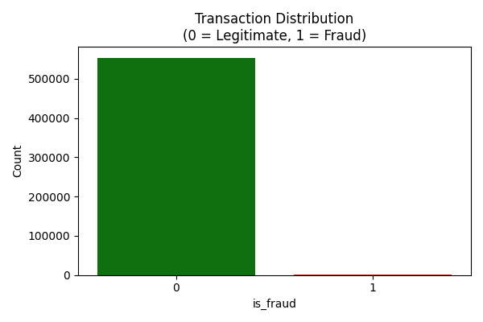
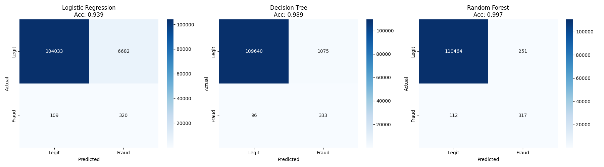
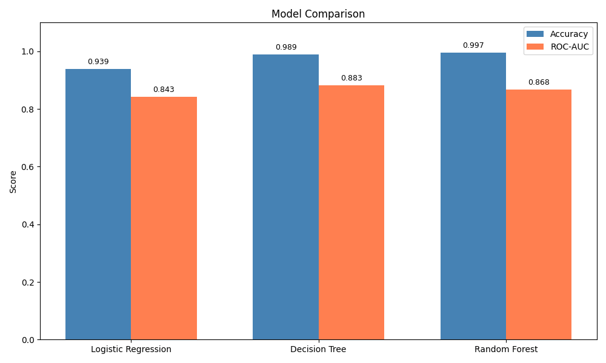

# 💳 Credit Card Fraud Detection

A Machine Learning project to detect fraudulent credit card transactions
using classification algorithms.

---

## 📌 Project Overview

This project was completed as **Task 2** of the **CodSoft Machine Learning Internship**.

The goal is to build a model that can classify credit card transactions as
**Fraudulent** or **Legitimate** using real-world data.

---

## 📂 Dataset

| Detail | Value |
|--------|-------|
| Total Transactions | 5,55,719 |
| Fraudulent Cases | 2,145 |
| Legitimate Cases | 5,53,574 |
| Total Features | 23 columns |
| Target Column | `is_fraud` (0 = Legitimate, 1 = Fraud) |

---

## 🛠️ Technologies Used

- Python 3.10
- Pandas
- NumPy
- Scikit-learn
- Matplotlib
- Seaborn
- Imbalanced-learn (SMOTE)

---

## ⚙️ Approach

1. **Data Loading** — Loaded dataset with 5,55,719 transactions
2. **Data Cleaning** — Dropped irrelevant columns (name, address, etc.), encoded categorical features
3. **Feature Scaling** — StandardScaler applied on numerical columns
4. **Handling Imbalance** — Used SMOTE to balance classes (885,718 training samples after SMOTE)
5. **Model Training** — Trained 3 different ML models
6. **Evaluation** — Compared models using Accuracy, ROC-AUC, Precision, Recall, F1-Score

---

## 🤖 Models Used

| Model | Description |
|-------|-------------|
| Logistic Regression | Simple linear classifier baseline model |
| Decision Tree | Rule-based tree classifier |
| Random Forest | Ensemble of multiple decision trees |

---

## 📊 Results

| Model | Accuracy | ROC-AUC | Fraud Precision | Fraud Recall | Fraud F1 |
|-------|----------|---------|-----------------|--------------|----------|
| Logistic Regression | 93.89% | 0.8428 | 0.05 | 0.75 | 0.09 |
| Decision Tree | 98.95% | 0.8833 | 0.24 | 0.78 | 0.36 |
| Random Forest | 99.67% | 0.8683 | 0.56 | 0.74 | 0.64 |

> 🏆 **Best Model: Decision Tree** with highest ROC-AUC Score of **0.8833**
>
> 💡 Random Forest had the best Accuracy (99.67%) and best Fraud F1-Score (0.64)

---

## 📈 Visualizations

### Class Distribution


### Confusion Matrices


### Model Comparison


---

## 🚀 How to Run

**1. Clone the repository**
```bash
git clone https://github.com/SohailKhan/credit-card-fraud-detection.git
```

**2. Install dependencies**
```bash
pip install pandas numpy scikit-learn matplotlib seaborn imbalanced-learn
```

**3. Run the project**
```bash
python fraud_detection.py
```

---

## 👨‍💻 Author

**Sohail Khan**  
CodSoft Machine Learning Intern

---

## 📜 License
This project is open source and available under the [MIT License](LICENSE).
